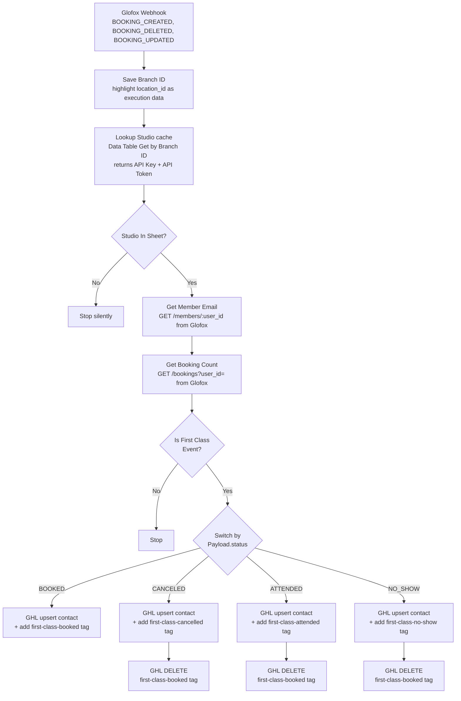

# Glofox → GHL First Class Automation — Overview

The deep-dive doc for this project. For a quick "what does this do" summary, see the [README](./README.md) in this folder. For the wider repo context, see the [repo root README](../README.md) and the [ONBOARDING guide](../ONBOARDING.md).

This document covers the full story of the **Glofox → GHL First Class** automation: why we moved off Zapier, how the infrastructure fits together, the per-branch logic, and current state.

---

## 1. Why we moved from Zapier to n8n

Our previous Zapier setup had three separate Zaps per studio (one each for first-class booked / cancelled / attended), each duplicating the same lookup logic. With dozens of studios, the count of Zaps and the surface for things to drift out of sync was getting unmanageable.

**n8n** gives us:

- A single workflow per studio that handles all three event types via branching, rather than three Zaps.
- Direct visibility into JSON payloads, expressions, and API calls — much easier to debug than Zapier's abstracted UI.
- Self-hosted execution: unlimited workflows, unlimited executions, no per-task cost.
- A real-code editor where we can build whatever logic we need (custom expressions, conditional filters, multi-step API flows).

---

## 2. Infrastructure setup

### 2.1 n8n instance

- Self-hosted at **`https://automation.social-fitness.com`**
- Software is free (community edition); fixed cost is just the hosting server
- All work is done in workflows owned by `Abhi Gupta <software@social-fitness.com>` in the n8n project

### 2.2 GitHub repo

- **`SocialFitnessManchester/n8n-automations`** — the source-of-truth for all workflow JSON exports and supporting docs
- One folder per project (e.g. this folder, `glofox-first-class/`)
- Inside each project folder, a `workflows/` directory holds the n8n JSON exports — one file per studio
- Cloned locally to `~/projects/automations/`

### 2.3 Git identity (anonymized)

Commits to any `SocialFitnessManchester/*` repo automatically use the identity `Social Fitness Automations <noreply@social-fitness.com>`. This is set up via a `~/.gitconfig` rule that matches the remote URL pattern, so no manual setup is needed per-repo. Other (non-SF) repos on the same machine are unaffected.

### 2.4 Credentials (in n8n)

The workflow uses two credentials, both configured in n8n's Credentials UI:

| Credential | Type | What it does |
|---|---|---|
| `Google Service Account account` | Google Service Account | Reads the studio config Google Sheet. The service account email is shared on the sheet with Viewer access. Used by the **Sync Studio Config → Data Table** workflow (which reads the sheet once per sync), not by the per-event webhook flow. |
| `HighLevel PIT - Test Sub Account` | HTTP Header Auth | `Authorization: Bearer pit-...` — talks to HighLevel V2 API on behalf of one GHL sub-account. One credential per sub-account. |

Why two different auth methods? Because:
- **Google Sheets** uses OAuth2 / service accounts — service accounts are best for unattended workflows.
- **GHL** has moved away from the legacy V1 API key. The modern path is either OAuth2 (which requires building a marketplace app) or **Private Integration Tokens** (PIT). PIT is per-sub-account, simpler to set up, and works perfectly for our use case.

### 2.5 Studio config cache (Data Table)

The webhook workflows no longer read the studio config Google Sheet on every event. At high volume (~79k events in 24h) that hit Google's Sheets read quota (~60 read-requests/min/user) and failed with HTTP 429 ("too many requests"). The fix (GitHub issue #19, now closed) introduces an internal cache:

- **`studio_config` Data Table** (n8n's built-in Data Table feature) holds one row per branch, with columns `branch_id` (key), `studio_name`, `api_key`, `api_token`, `ghl_location`, `ghl_pit`. The webhook flow's **"Lookup Studio (cache)"** node does a Data Table "Get row" by `branch_id` — an internal DB lookup with no external rate limit.
- A separate **"Sync Studio Config → Data Table"** workflow (n8n id `mKrkdoAQ85WCZiJF`; repo folder [`../sync-studio-config/`](../sync-studio-config/)) keeps the table in sync with the Google Sheet. It reads the sheet **once per run** and upserts into the Data Table, on a **15-minute schedule** plus an **instant refresh** path: a secured webhook `POST /webhook/refresh-studio-config` (Header-Auth secret) fired by an installable Apps Script `onChange` trigger on the sheet, so edits propagate immediately.

The Google Sheet stays the human-editable source of truth — it's just read once per sync rather than once per event.

---

## 3. The Glofox → GHL First Class automation

### 3.1 What it does, in one sentence

When a member books, cancels, or attends what amounts to their first class at a studio, apply the corresponding tag in Go High Level (`first-class-booked`, `first-class-cancelled`, `first-class-attended`) so the existing GHL workflows can take over the welcome / follow-up / re-engagement automations.

### 3.2 The flow

Failures on any node route to the shared **Error Handler** workflow (`AKbzN48d9DQwMioQ`), wired via the workflow's `errorWorkflow` setting; it posts to Slack `#5c-n8n-errors`.

### 3.3 Step-by-step

1. **Glofox webhook fires** when a booking is created, deleted, or updated. The webhook payload's top-level keys are **PascalCase** — `Type`, `Metadata`, `Payload` — while nested keys (`location_id`, `user_id`, `attended`, etc.) stay lowercase. The top-level `Type` field tells you the event kind (`BOOKING_CREATED` / `BOOKING_DELETED` / `BOOKING_UPDATED`); for `BOOKING_UPDATED` the `Payload.attended` boolean distinguishes an attendance (`true`) from a no-show (`false`). We route on `Type` + `Payload.attended`. (Earlier docs/code used lowercase top-level keys.)

   Immediately after the webhook, a **"Save Branch ID (filter)"** Execution Data node saves `Metadata.location_id` as highlighted execution data, so runs are filterable per-studio in the Executions list.

2. **Studio config lookup (Data Table cache).** The webhook payload includes a `Metadata.location_id`, which the **"Lookup Studio (cache)"** node matches against the **`branch_id`** key column of the n8n **Data Table** `studio_config` (a "Get row" where `branch_id == Metadata.location_id`). The row gives us the Glofox API Key + Token for that branch. This is an internal DB lookup with **no external rate limit** — it replaced a direct per-event read of the Google Sheet, which hit Google's Sheets read quota (~60 requests/min/user) and failed with HTTP 429 under high volume (~79k events in 24h; see [§2.5](#25-studio-config-cache-data-table) and GitHub issue #19). The downstream **`Studio In Sheet?`** guard halts the run silently when no row is returned (unknown studio); the old "Unknown Studio / Bad Input" Stop & Error guard that used to alert on this has been removed.

3. **Get member details from Glofox** — calls `GET /prod/2.0/members/{user_id}` to retrieve email, first name, last name, phone, and consent fields. This is what gets pushed to GHL.

4. **Get bookings history from Glofox** — calls `GET /prod/2.0/bookings?user_id={user_id}` to retrieve the member's full booking list (cancelled bookings stay in the list with `status: CANCELED`). We use this to figure out whether this event is genuinely the member's first class.

5. **"Is First Class Event?" filter.** One IF node with branching logic by event status:
   - **BOOKED** event passes if the count of *non-cancelled* bookings is exactly 1. This catches first-ever bookings AND re-bookings after a cancellation (where the member's first booking was cancelled, then they re-booked — we treat the re-booking as their real first class).
   - **CANCELED** event passes if non-cancelled count is 0 AND total bookings is 1 — i.e. this cancellation just removed their only-ever booking. This ensures we don't double-fire if a member cancels multiple times.
   - **ATTENDED** event (`BOOKING_UPDATED` + `attended === true`) passes if attended count is 1.
   - **NO_SHOW** event (`BOOKING_UPDATED` + `attended === false`) passes if the count of *non-cancelled* bookings is 1.

6. **Switch by event status.** Routes the item to one of four branches: BOOKED, CANCELED, ATTENDED, or NO_SHOW.

7. **Each branch does its GHL action(s):**
   - **BOOKED:** one HTTP call — `POST /contacts/upsert` with email, name, phone, and the `first-class-booked` tag. Creates the contact if missing, updates if existing, all in one shot. GHL's tag-added event triggers the welcome automation.
   - **CANCELED:** two HTTP calls — first an upsert with the `first-class-cancelled` tag, then a `DELETE /contacts/{id}/tags` to remove the `first-class-booked` tag. Removing the booked tag is what makes a future re-booking re-fire the welcome automation (since the tag wouldn't otherwise be a new addition).
   - **ATTENDED:** one upsert with `first-class-attended` tag, then a `DELETE /contacts/{id}/tags` to remove `first-class-booked` (mirrors the CANCELED pattern).
   - **NO_SHOW:** fires on `BOOKING_UPDATED` + `payload.attended === false` — one upsert with the `first-class-no-show` tag, then a `DELETE /contacts/{id}/tags` to remove `first-class-booked` (mirrors the ATTENDED pattern). _Note: the `first-class-no-show` tag and the hardcoded test location are placeholders pending go-live confirmation._

> The old **"Create a lead"** custom node (an earlier experiment that pushed the member into Glofox as a lead via the `n8n-nodes-glofox` community node) has been **removed** from this workflow — it isn't part of the first-class tagging flow.

### 3.4 Decisions worth knowing about

- **Marketing consent.** We default to "yes" — we don't read Glofox's `consent.email.active` block and don't set GHL's DND flags. Reason: anyone reaching this point has already consented at the Glofox booking step upstream. Re-validating would just add complexity.

- **One workflow per studio (for now).** Each studio has its own n8n workflow with a hardcoded GHL Location ID and a dedicated PIT credential. This mirrors the Zapier pattern (one Zap per studio) and was the fastest way to ship. The long-term play is one master workflow that picks the GHL location dynamically from the `studio_config` cache (whose `ghl_location` / `ghl_pit` columns already exist) — but it requires rewiring how the GHL nodes reference credentials.

- **Webhook URLs require Glofox staff to register them.** Every new endpoint = a Glofox support ticket. This argues against having dozens of webhook URLs (one per studio per event) and pushes us toward consolidation — but it's a tradeoff we'll revisit.

- **We use Glofox's `total_count` + filtered `status` rather than their `is_first` field.** The `is_first` flag is dynamic — it flips to `false` when a booking is cancelled, even though the cancelled booking *was* their first. Filtered counting gives us historical correctness.

---

## 4. Current state per branch

The workflow is **ACTIVE** and running on the Data Table cache. Since the cutover to the cache (issue #19), it has handled live traffic with **zero HTTP 429 errors**.

| Branch | Status | Notes |
|---|---|---|
| **First class booked** | ✅ Working | Tested end-to-end on live data. Contact created in GHL with name, email, phone, and tag in a single API call. |
| **First class cancelled** | ✅ Working | Tested end-to-end on live data. Adds `first-class-cancelled` tag, removes `first-class-booked`. |
| **First class attended** | ✅ Working | Tested end-to-end on live data (Glofox fires `BOOKING_UPDATED` with `Payload.attended: true` to signal attendance — `Payload.status` stays `BOOKED`). Adds `first-class-attended` tag, removes `first-class-booked`. |
| **First class no-show** | 🚧 Blocked on Glofox | Built to fire on `BOOKING_UPDATED` + `Payload.attended: false` (adds `first-class-no-show` tag, removes `first-class-booked`, mirroring the attended branch), but **can't be exercised**: Glofox doesn't appear to fire any webhook when a booking is marked no-show. Open question with Glofox. Tag name and hardcoded test location remain placeholders. |

---

## 5. How to add a new studio (when we're ready to roll out)

> **Direction of travel:** the long-term target is the Data Table cache (§2.5) feeding a single master workflow. In that model, adding a studio is just **adding a row to the studio config sheet** — the sync workflow picks it up into the `studio_config` cache within 15 minutes (or instantly, via the `onChange` instant-refresh webhook), and the master workflow resolves everything it needs from that row. The per-studio steps below are the **current manual process** until that consolidation is complete.

1. **Add a row to the [studio config sheet](https://docs.google.com/spreadsheets/d/10JeveuIeXNGsGyDQD5dvFLKzOoOzIN8ffRwszGuu2XA/edit)** — Studio Name, Branch ID (from Glofox), API Key, API Token. (The sync workflow upserts this into the `studio_config` Data Table that the webhook flow reads.)
2. **Create a Private Integration in the GHL sub-account** (Settings → Private Integrations) with View/Edit Contacts scopes. Copy the PIT.
3. **Note the GHL Location ID** for the sub-account (Settings → Business Profile).
4. **In n8n: duplicate the test workflow**, update:
   - Workflow name (e.g. `Glofox First Class — Studio X`)
   - Webhook path (e.g. `glofox-first-class-studio-x`)
   - Create a new HTTP Header Auth credential for the new PIT, assign to all three GHL HTTP nodes
   - Replace the Location ID in each GHL HTTP body
5. **Export the workflow JSON** from n8n and add it to `workflows/<studio-name>.json` in this folder. Commit + push.
6. **Submit a ticket to Glofox support** to register the new webhook URL on the studio's Glofox account.

---

## 6. Open items / what's next

- **Total attendance count to GHL custom field:** for downstream GHL automations triggered on milestones (e.g. 5 / 10 / 25 classes attended). Plan: a parallel branch off `Get Booking Count` that fires on every `BOOKING_UPDATED + attended === true` event (not gated by first-class filter), derives the count via `data.filter(b => b.attended === true).length`, and PUTs/upserts a GHL custom field. Needs the GHL custom field to be created first and its Custom Field ID captured.
- **Studio config cache (#19): ✅ done.** The webhook flow now resolves studio config from the `studio_config` Data Table instead of reading the Google Sheet per event, kept in sync by the **Sync Studio Config → Data Table** workflow (§2.5). This eliminated the HTTP 429 failures seen at high volume; the workflow has run on live traffic with zero 429 errors since. Issue #19 is closed.
- **No-show case: 🚧 blocked on Glofox.** The **NO_SHOW** branch is built (fires on `BOOKING_UPDATED` + `Payload.attended: false`, tags `first-class-no-show`, removes `first-class-booked`), but Glofox doesn't appear to fire any webhook when a booking is marked no-show, so the branch can't be exercised. Open question with Glofox. Once that's resolved, still to confirm before go-live: the exact GHL tag name for the re-engagement automation, and moving the location off the hardcoded test value to the studio config sheet.
- **GHL sub-account is currently hardcoded per workflow:** the GHL HTTP nodes each use a hardcoded test `locationId` (`JHgfCMprry4fxGOzRsYl`) baked into the body and the `HighLevel PIT - Test Sub Account` HTTP Header Auth credential — **not** read from the cache. Only the Glofox API creds come from the `studio_config` cache. The `studio_config` Data Table already carries `ghl_location` and `ghl_pit` columns for this purpose; the remaining work is rewiring the GHL nodes to read both from the cache row (analogous to how Glofox creds work today). That turns it into one master workflow that handles every studio.
- **Multi-studio consolidation:** once the per-studio approach is proven across a few studios, consider collapsing to a single master workflow with dynamic GHL credential lookup from the cache. Saves on maintenance and on Glofox support tickets (one webhook URL handles all studios). Depends on the previous item being done.
- **New workflow: Purchase → first-class nudge:** when a member completes a purchase in Glofox (separate webhook event, payload still TBC), wait 10 minutes, then check if they've booked a class. If yes, apply `first-class-booked` tag as a safety net; if no, apply a nudge tag like `purchase-no-booking-yet` that triggers a "please book your first class" automation in GHL. Same upstream as the First Class workflow (Data Table cache lookup, member email lookup) plus a Wait node and post-wait booking check. Needs: a sample purchase webhook payload from Glofox + the exact GHL tag name for the nudge automation + Glofox support to register the webhook URL if it's not already firing through the existing endpoint.
- **Error handling:** ✅ wired — the workflow's `errorWorkflow` setting routes any node failure (GHL API error, Glofox API error, etc.) to the shared **Error Handler** workflow (`AKbzN48d9DQwMioQ`), which posts to Slack `#5c-n8n-errors`.
- **Cut over from Zapier:** the existing Zapier flow is still receiving Glofox webhooks. When we're ready, Glofox needs to switch the registered URL from the Zapier endpoint to the n8n endpoint, and we pause the corresponding Zaps.
